# Extract The Zip File and Open the Project in Visual Studio 2022 or Later


# 🛒 ShopEZWeb.API

A **E-Commerce Backend Web API** built using **ASP.NET Core Web API**, **Entity Framework Core**, and **SQL Server**.

This project supports **product management, order processing with stock validation, and role-based access control**.

---

## 🚀 Features

* 🔐 JWT Authentication
* 👥 Role-based Authorization (Admin / User)
* 📦 Product CRUD Operations
* 🛒 Multi-product Order Placement
* 📉 Automatic Stock Deduction
* 🗄️ SQL Server + EF Core Code First
* 🧱 Layered Architecture (Controller → Service → Repository)
* 🧪 Swagger + Postman Testing

---

## 👥 User Roles and Permissions

### 👑 Admin

Admin is responsible for **product management and full order supervision**.

✅ Admin can:
- Register and login
- Add new products
- View all products
- Update products
- Delete products
- View all orders

### 🙋 User

User is responsible for **shopping and managing personal orders**.

✅ User can:
- Register and login
- View all products
- Place multi-product orders
- View their own orders

❌ User cannot:
- Add products
- Update products
- Delete products

---

## 🧱 Architecture

```
Controller → Service → Repository → DbContext → SQL Server
```

---

## 📁 Project Structure

```
ECommerce_API/
├── Controllers/
│   ├── AuthController.cs
│   ├── ProductsController.cs
│   └── OrdersController.cs
├── Models/
│   ├── User.cs
│   ├── Product.cs
│   ├── Order.cs
│   └── OrderItem.cs
├── DTOs/
│   ├── RegisterDTO.cs
│   ├── LoginDTO.cs
│   ├── ProductDTO.cs
│   └── OrderDTO.cs
├── Interfaces/
│   ├── IProductRepository.cs
│   └── IProductService.cs
├── Repositories/
│   └── ProductRepository.cs
├── Services/
│   └── ProductService.cs
├── Data/
│   └── ApplicationDbContext.cs
├── appsettings.json
└── Program.cs
```

---

## 🗄️ Database Tables

| Table      | Description                               |
|------------|-------------------------------------------|
| Users      | Stores registered users with roles        |
| Products   | Stores product details                    |
| Orders     | Stores order information per user         |
| OrderItems | Stores individual items inside each order |

### Relationships

* One User → Many Orders
* One Order → Many OrderItems
* One Product → Many OrderItems

---

## 🔐 Authentication Flow

### Register

`POST /api/Auth/Register`

### Login

`POST /api/Auth/Login`

Returns a **JWT Token** — use this in the Authorization header for protected routes.

### How to use JWT Token in Postman:

1. Login and copy the token from the response
2. In Postman → Headers → Add: `Authorization: Bearer <your_token>`

---

## 📦 Product APIs

| Method | Endpoint             | Access           |
|--------|----------------------|------------------|
| GET    | `/api/products`      | All (with token) |
| GET    | `/api/products/{id}` | All (with token) |
| POST   | `/api/products`      | Admin only       |
| PUT    | `/api/products/{id}` | Admin only       |
| DELETE | `/api/products/{id}` | Admin only       |

> ⚠️ Product write APIs (POST, PUT, DELETE) are restricted to **Admin role only**.  
> If a User tries to add/update/delete a product → **403 Forbidden**

---

## 🛒 Order APIs

| Method | Endpoint            | Access            |
|--------|---------------------|-------------------|
| POST   | `/api/orders`       | User (with token) |
| GET    | `/api/orders`       | Admin only        |
| GET    | `/api/orders/{id}`  | Admin only        |

### Order Creation Logic:

When a user places an order:
1. Accepts cart items (productId + quantity)
2. Validates product existence
3. Validates quantity > 0
4. Checks stock availability
5. Calculates total amount
6. Creates Order and OrderItems in database
7. Automatically reduces product stock

---

## ⚙️ How to Run Locally

### Step 1 — Install NuGet Packages

Open Package Manager Console and run:

```
Install-Package Microsoft.EntityFrameworkCore.SqlServer
Install-Package Microsoft.EntityFrameworkCore.Tools
Install-Package Microsoft.AspNetCore.Authentication.JwtBearer
Install-Package Swashbuckle.AspNetCore
```

### Step 2 — Update Connection String

Open `appsettings.json` and change:

```json
"DefaultConnection": "Server=YOUR_SERVER_NAME;Database=ECommerceDb;Trusted_Connection=True;TrustServerCertificate=True;"
```

Replace `YOUR_SERVER_NAME` with your SQL Server name (e.g., `localhost` or `.\SQLEXPRESS`)

### Step 3 — Create Database

Run in Package Manager Console:

```
Add-Migration InitialCreate
Update-Database
```

### Step 4 — Run the API

Press **F5** in Visual Studio or run:

```bash
dotnet run
```

### Step 5 — Open Swagger

```
https://localhost:7259/swagger
```

### Step 6 — Test with Postman

Use the testing flow below with JWT tokens.

---

## 🧪 Testing Flow

1. Register Admin user → `POST /api/Auth/Register` with role: "Admin"
2. Login as Admin → `POST /api/Auth/Login` → Copy JWT token
3. Add products using Admin token → `POST /api/products`
4. Register User → `POST /api/Auth/Register` with role: "User"
5. Login as User → Copy User JWT token
6. Place an order as User → `POST /api/orders`
7. Try to add product as User → Expect **403 Forbidden**
8. Verify stock was reduced after order

---

## 📸 API Testing Screenshots

All screenshots below show complete **end-to-end verification of ShopEZ APIs tested in Postman**.

---

### 🔐 Authentication

#### ✅ Admin Registration

Register an admin user with role "Admin".

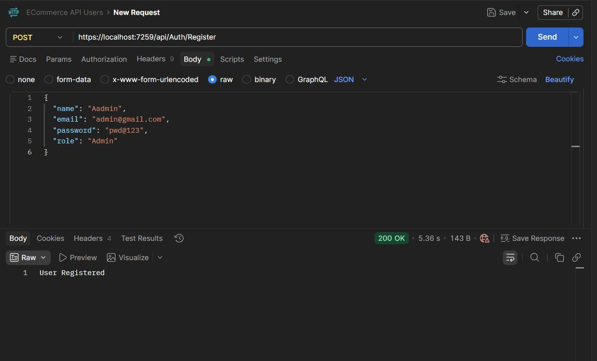

---

#### ✅ Admin Login — JWT Token Received

Login with admin credentials and receive JWT token.

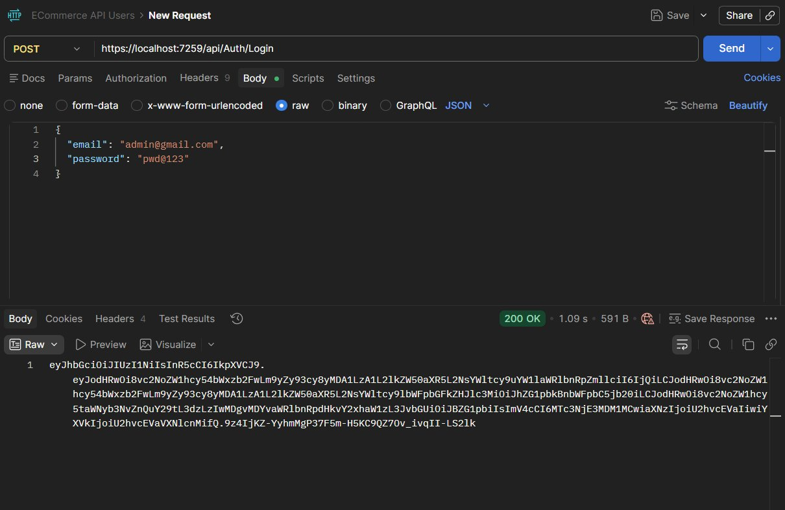

---

#### ✅ User Registration

Register a normal user with role "User".

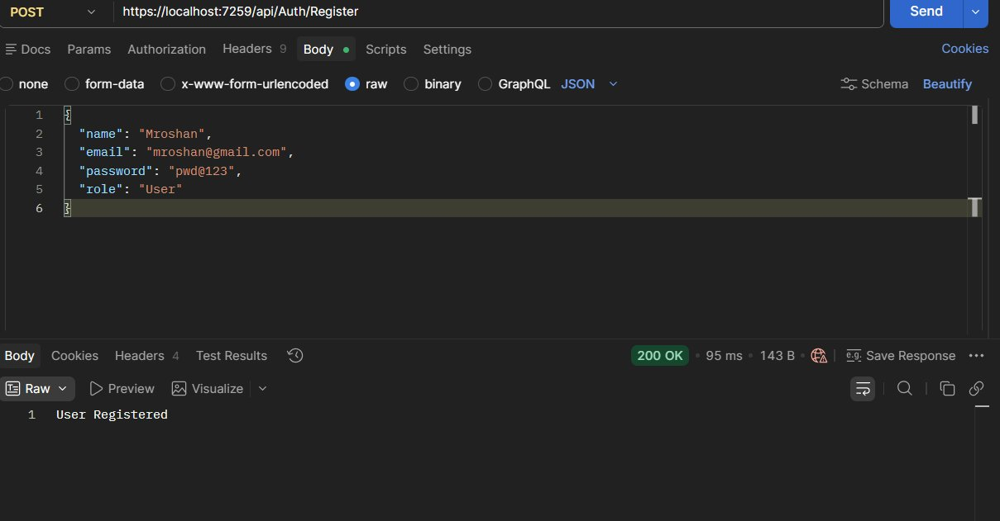

---

#### ✅ User Login — JWT Token Received

Login with user credentials and receive JWT token.

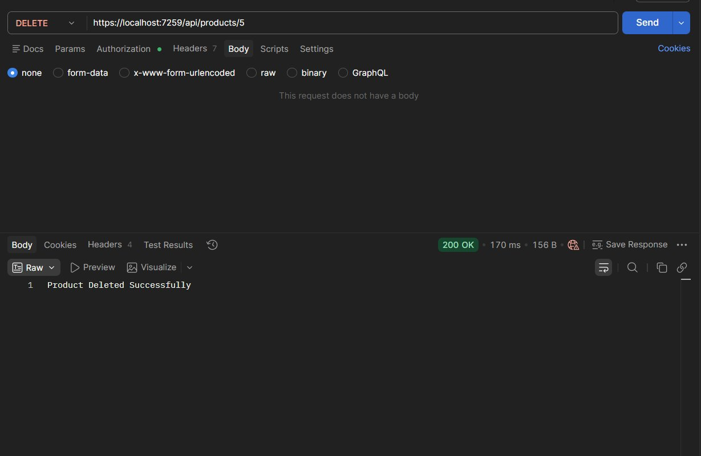

---

### 📦 Product CRUD

#### ✅ Add Product (Admin)

Admin adds a new product successfully.

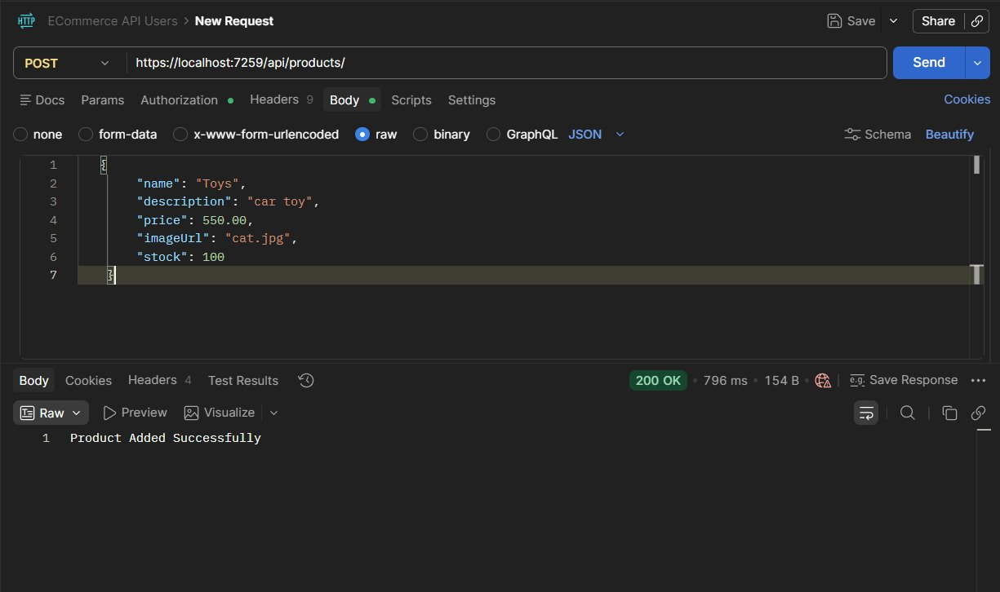

---

#### ✅ Get All Products

Retrieve all products from the database.

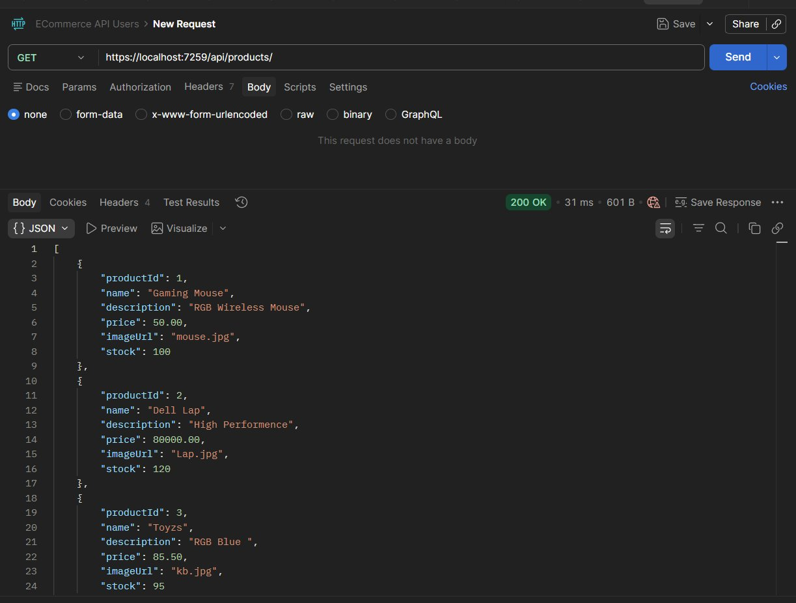

---

#### ✅ Get Product By ID

Retrieve a specific product by its ID.

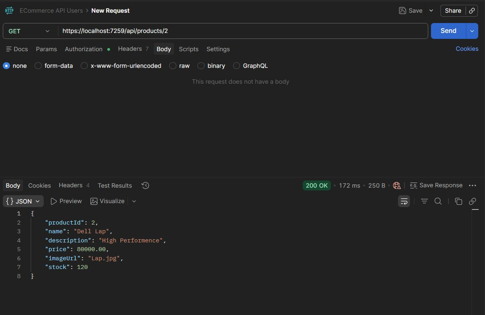

---

#### ✅ Update Product (Admin)

Admin updates product details successfully.

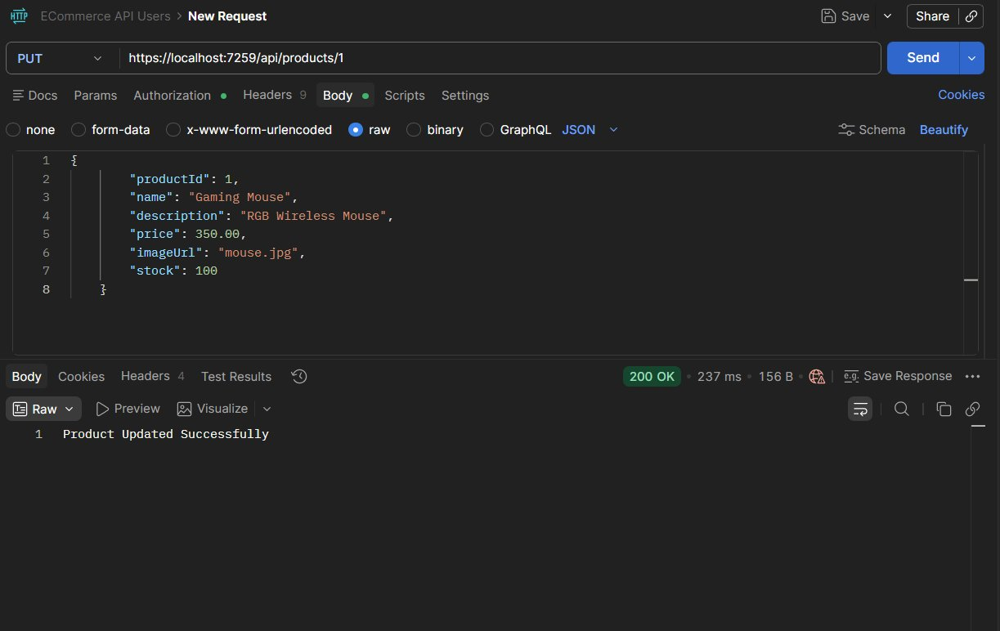

---

#### ✅ Delete Product (Admin)

Admin deletes a product successfully.

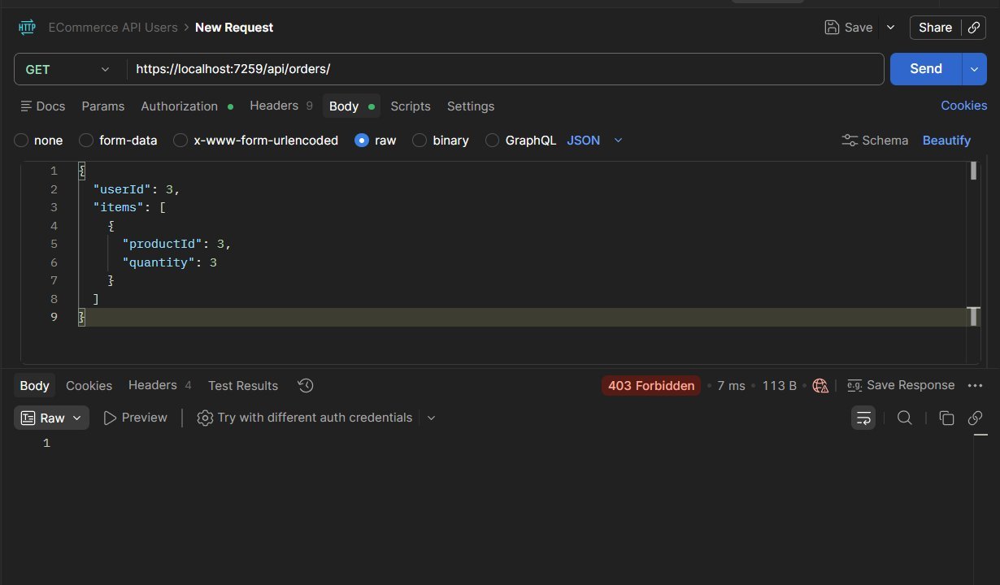

---

#### ❌ Forbidden — User Tries to Add Product

User with "User" role gets **403 Forbidden** when trying to add a product.

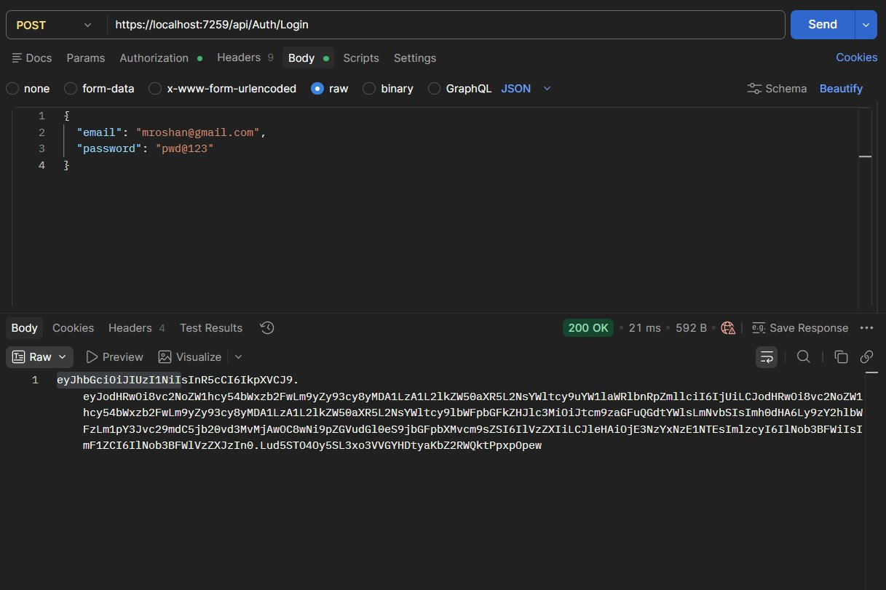

---

#### ❌ Forbidden — User Tries to Delete Product

User with "User" role gets **403 Forbidden** when trying to delete a product.

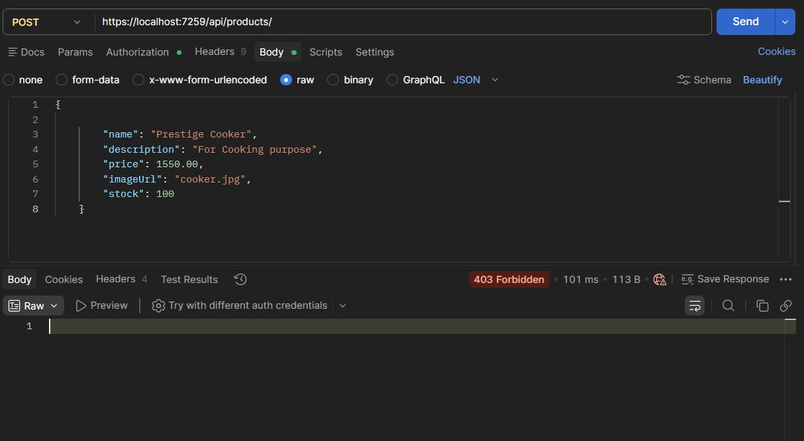

---

### 🛒 Order Processing

#### ✅ Create Order (User)

User places a multi-product order successfully. Stock is automatically deducted.

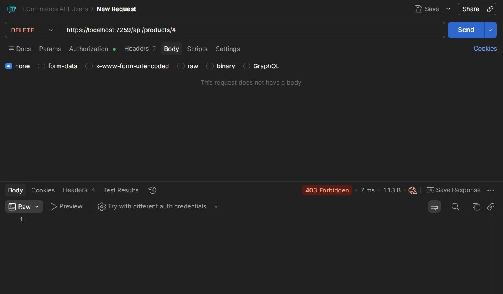

---

#### ❌ Forbidden — Unauthorized Access to Orders

Accessing orders without proper Admin role gets **403 Forbidden**.

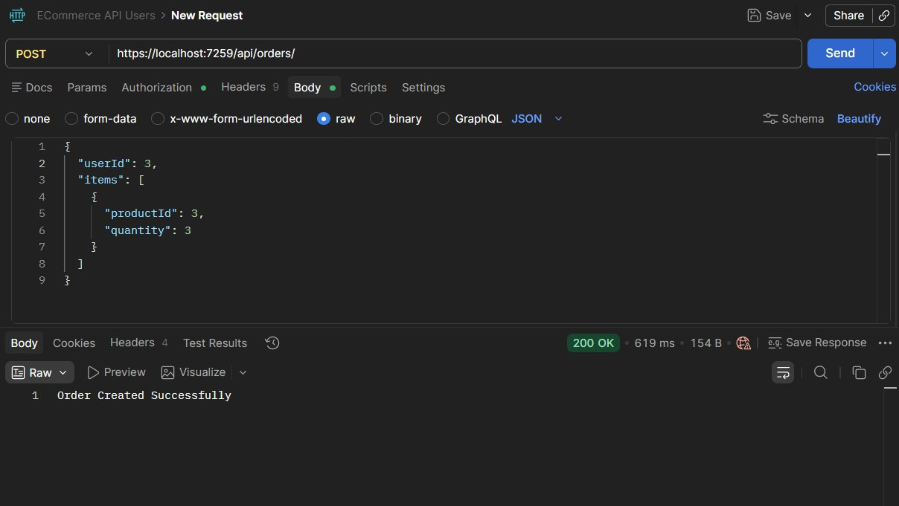

---

## ✅ What Was Verified

| Feature                                    | Status     |
|--------------------------------------------|------------|
| Admin Registration                         | ✅ Working |
| Admin Login + JWT                          | ✅ Working |
| User Registration                          | ✅ Working |
| User Login + JWT                           | ✅ Working |
| Add Product (Admin)                        | ✅ Working |
| Get All Products                           | ✅ Working |
| Get Product By ID                          | ✅ Working |
| Update Product (Admin)                     | ✅ Working |
| Delete Product (Admin)                     | ✅ Working |
| 403 Forbidden for User on Product Write    | ✅ Working |
| Create Order (User)                        | ✅ Working |
| Stock Deduction on Order                   | ✅ Working |
| 403 Forbidden on Unauthorized Order Access | ✅ Working |

---

## 🌟 Key Highlights

This project demonstrates:

* Interface-based Repository Pattern (`IProductRepository`)
* Interface-based Service Layer (`IProductService`)
* DTO usage (no direct entity exposure)
* JWT Authentication & Role Authorization
* EF Core Code First with Migrations
* SQL Server Integration
* Layered Architecture (Controller → Service → Repository → DbContext)
* Async/Await throughout all database operations
* Input Validation and Exception Handling
* Clean API Design with proper HTTP status codes

---

## 👨‍💻 Author

**ManiarRoshan**

Built as part of **.NET Full Stack Development Training**
